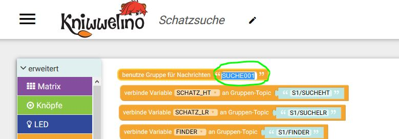
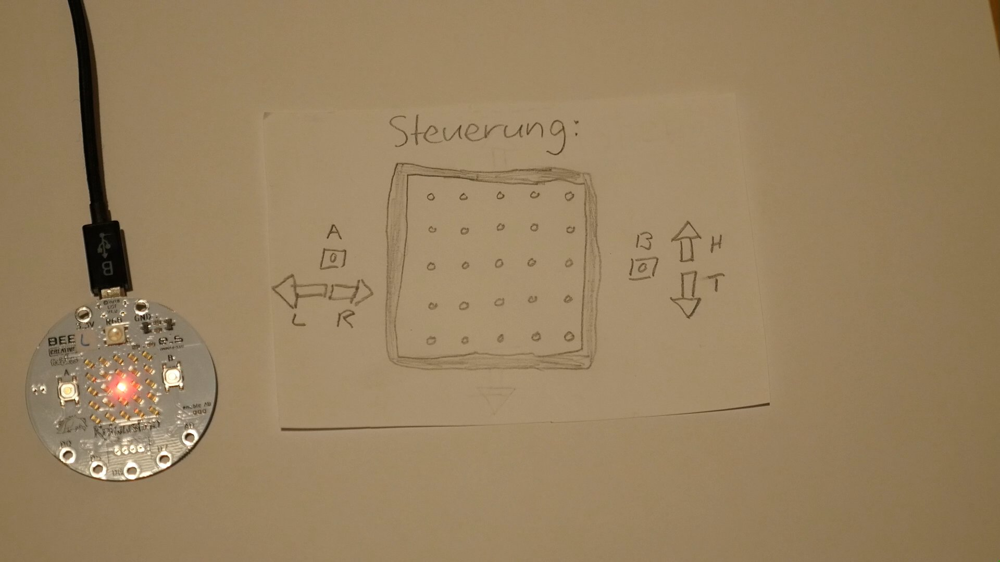
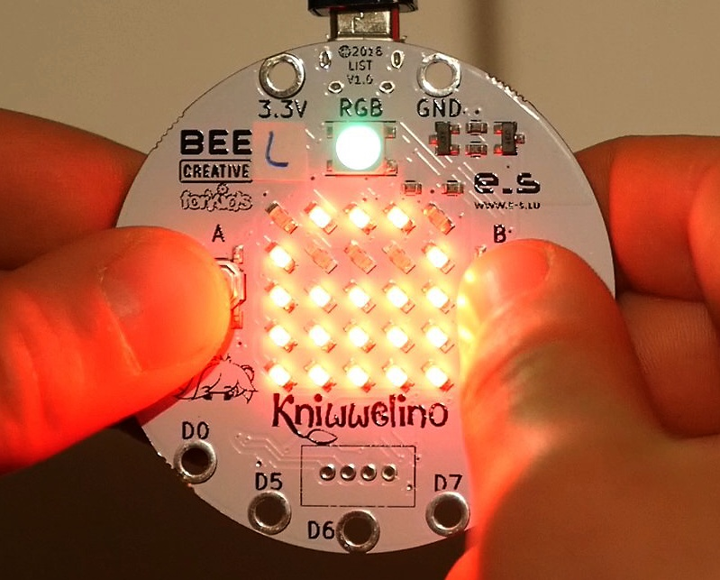
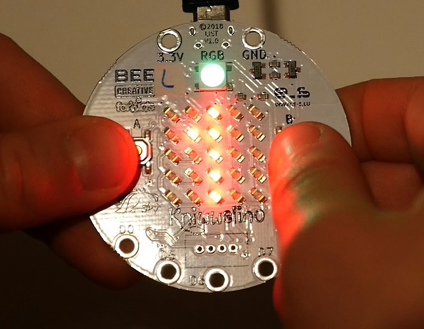
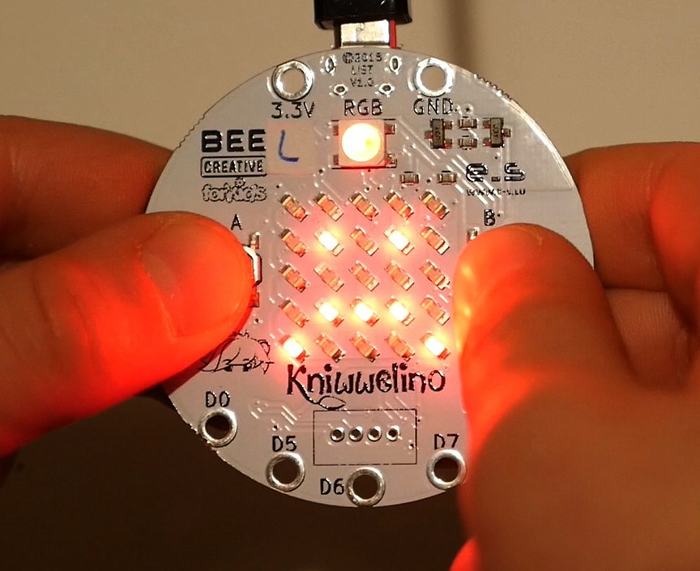
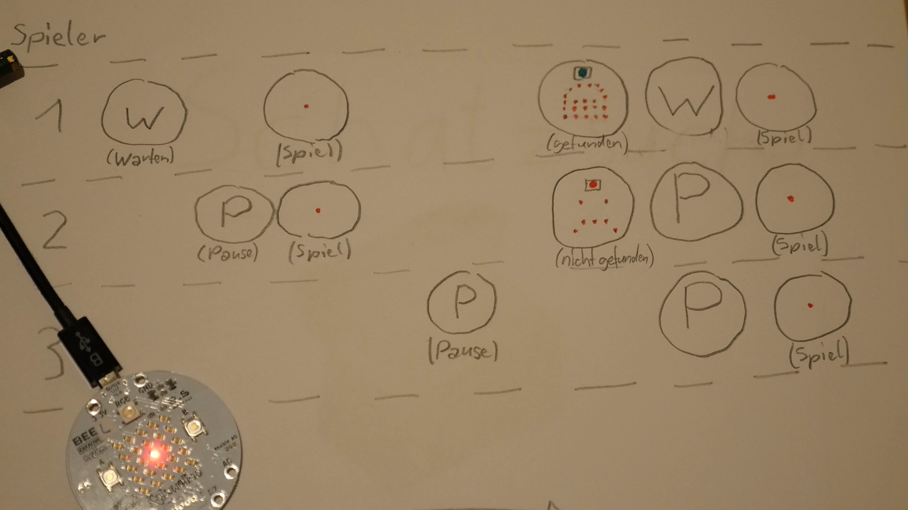

# Schatzsuche
#Kniwwelino
#KniwwelinoChallenge2018

_English Version bellow!_

# Kniwwelino Schatzsuche (Deutsche Version)

Das Spiel Schatzsuche mit dem Kniwwelino haben wir im Zuge vom Wettbewerb 2018 (#KniwwelinoChallenge2018) entwickelt.
Um das Spiel zu spielen braucht man einen oder mehrere Kniwwelino's (https://www.kniwwelino.lu/).

Ziel des Spieles ist es einen versteckten Schatz auf dem Spielfeld als erter zu finden. Am Spiel können mehrere Spieler mitspielen.

Der erste Spieler welcher den Schatz gefunden hat bekommt einen Punkt. Der Schatz ist irgendwo auf dem Spielfeld unter einer roten Led versteckt.

## Installation

Laden Sie die Datei [Kniwwelino_Schatzsuche_V1.0.xml](Kniwwelino_Schatzsuche_V1.0.xml) in den Editor http://code.kniwwelino.lu/. Es empfiehlt sich zur Abgrenzung gegenüber anderen Spielern diese Nachrichten ID auf einen beliebigen Wert anpassen. Übertragen Sie die das Programm auf jeden Kniwwelino welcher mitspielen will. 

## Ablauf / Spielen

Der erste Spieler welcher seinen Kniwwelino gestartet hat wartet einige Sekunden auf weitere Spieler. Dieser erste Spieler sieht einen W für "Warten auf Spieler". Wenn in dieser Zeit ein Spieler dazukommt wartet er biss das Spiel anfängt. In dieser Zeit sieht der Spieler einen P für "Pause". Nach einigen Sekunden wird vom ersten Spieler das Spiel gestartet. Der Schatz wird auf dem Spielfeld an einer beliebigen Position versteckt. Alle Spieler sehen jetzt eine rote Led in der Mitte des Spieles, das ist ihre Position. Sie können jetzt mit den Tasten A und B ihre Position verschieben. 

Das Ziel ist es den Schatz zu finden. Sobald ein Spieler den Schatz gefunden hat sieht er das Schatzsymbol und die RGB Led leuchtet grün. 

Dieser Spieler erhält einen Punkt. Die Anzahl der Punkte erhält jeder Spieler nach dem Spiel angezeigt.

Alle anderen Spieler sehen einen traurigen Smiley und die RGB Led leuchtet Rot. 

Danach geht das ganze wieder von vorne los. Wenn in der Zeit in welcher das Spiel bereits läuft ein Spieler dazukommt, dann muss er warten bis das laufende Spiel beendet wurde. In dieser Zeit sieht er einen P für Pause.

# Kniwwelino treasure quest ( English version )

We developed the treasure quest game for the Kniwwelino Challenge 2018 (#KniwwelinoChallenge2018).
To play this game you need one or more Kniwwelino's (https://www.kniwwelino.lu/).

The goal of the game is to find as first the treasure on the playing field. The game can be played by one or multiple Players.

The first player who found the treasure will get one pint. The treasure is somewhere hidden on the playing field.

## Installation

Load the file [Kniwwelino_Schatzsuche_V1.0.xml](Kniwwelino_Schatzsuche_V1.0.xml) to the editor http://code.kniwwelino.lu/. It's better to change the message ID in order to separate you from other players. You can maintain a value you like. Download the program to every Kniwwelino who wants to participate. 

## Procedure / Play

The first player who start up his kniwwelino has to wait some seconds for other players. This first player will see a W for "wait for others". When an other player will join him he has to wait until the game starts. In this waiting time the other player will see a P for "Pause". Some Seconds later the game will start automatically. The treasure will be placed automatically somewhere on the playing field. All players can see now his own position showed by the red led in the middle of the playing field. You can now move your position with the key's A and B.

The goal is to find the treasure first. As soon as one player has found the treasure he will see the treasure symbol and the RGB led lights up green.

This player will get one point. The number of points every player will seen after each game.

All other player will see a sad smiley and the RGB Led will light up red.

After one treasure chest the game starts up again. If one new player tries to join the game while it's running. He has to wait until the running game ended up. In this time he will see a P for "Pause".

