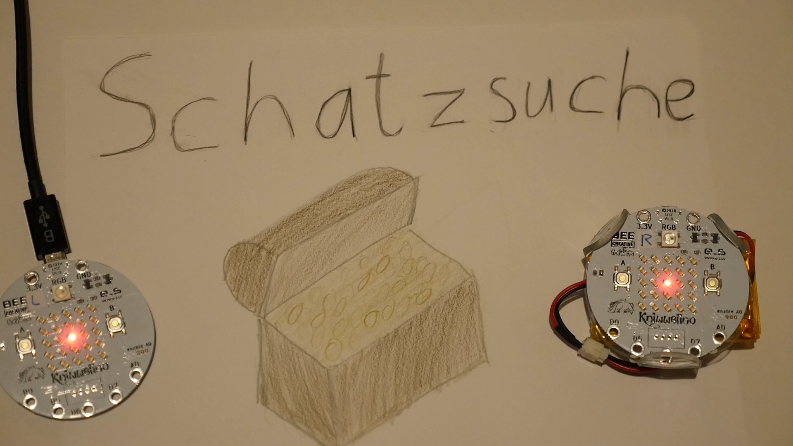

# Schatzsuche
#Kniwwelino
#KniwwelinoChallenge2018

# Kniwwelino Schatzsuche

Das Spiel Schatzsuche mit dem Kniwwelino haben wir im Zuge vom Wettbewerb 2018 (#KniwwelinoChallenge2018) entwickelt.
Um das Spiel zu spielen braucht man einen oder mehrere Kniwwelino's (https://www.kniwwelino.lu/).

Ziel des Spieles ist es einen versteckten Schatz auf dem Spielfeld zu finden. Am Spiel können mehrere Spieler mitspielen.

Der erste Spieler welcher den Schatz gefunden hat bekommt einen Punkt.

## Installation

Laden Sie die Datei Kniwwelino_Schatzsuche_V1.0.xml in den Editor http://code.kniwwelino.lu/ und übertragen Sie die das Programm.
Zur Abgrenzung gegenüber anderen Spielern können Sie die Nachrichten ID auf einen beliebigen Wert anpassen.

## Ablauf / Spielen

Der erste Spieler welcher seinen Kniwwelino gestartet hat wartet einige Sekunden auf weitere Spieler dieser Spieler sieht einen W für Warten auf Spieler. Wenn in dieser Zeit ein Spieler dazukommt wartet er biss das Spiel anfängt. In dieser Zeit sieht der Spieler einen P für Pause. Nach einigen Sekunden wird vom ersten Spieler das Spiel gestartet. Der Schatz wird auf dem Spielfeld an einer beliebigen Position versteckt. Alle Spieler sehen jetzt eine Rote Led in der Mitte des Spieles. Sie können jetzt mit den Tasten A und B ihre Position verschieben. Das Ziel ist es den Schatz zu finden.

Sobald ein Spieler den Schatz gefunden hat sieht er das Schatzsymbol und die RGB Led leuchtet grün. Dieser Spieler erhält einen Punkt. Alle anderen Spieler sehen einen traurigen Smiley und die RGB Led leuchtet Rot. 

Danach geht das ganze wieder von vorne los. Wenn in der Zeit in welcher das Spiel bereits läuft dazukommt, dann muss er warten bis das laufende Spiel beendet wurde. In dieser Zeit sieht er einen P für Pause.

